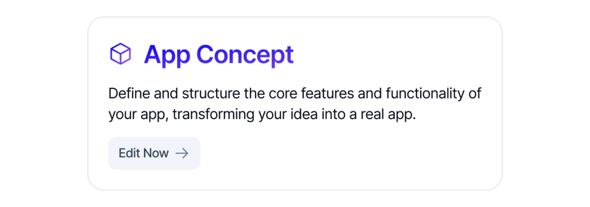
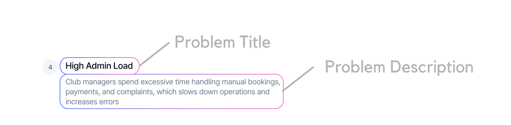
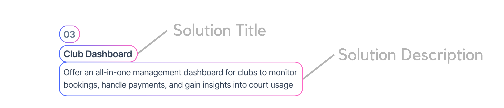
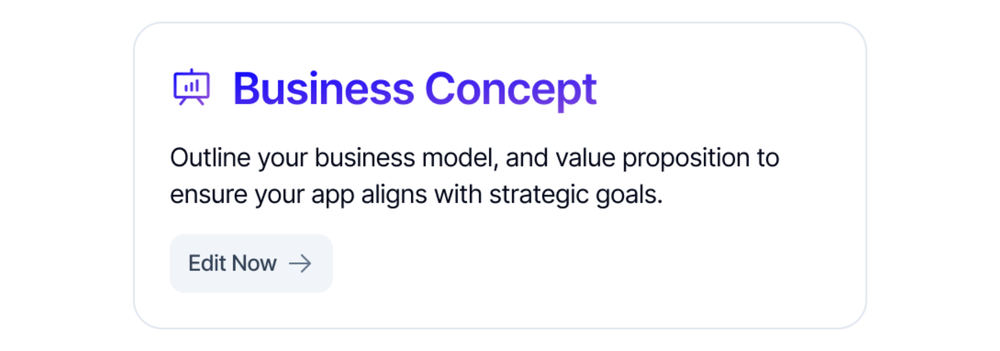

# <strong>Concept</strong>

In <strong>Concept</strong> customization, you define the foundation of your app through structured prompts.

## <strong>App Concept</strong>

<em>App Concept</em>

When you generate a new app in QuantumByte, you’ll start with the App Concept. This is more than just a formality. It’s the foundation that guides how your app is built and what value it delivers. The App Concept is made up of three key parts:

### Problem Statement
  

        
Define the challenge your app is meant to solve. This includes a <strong>Problem Title</strong> and a <strong>Problem Description</strong>. A clear problem statement ensures your app has purpose and direction.

             

             
                 

<em>ex. Problem Definition</em>

            

    

    
### Solution
 

        
Describe how your app will solve the problem. The <strong>Solution Title</strong> sums up the approach, while the <strong>Solution Description</strong> explains the details. This helps QuantumByte generate an app that aligns with your vision.

             

             
                 

<em>ex. Solution Definition</em>

            

    

### Goals
  

        
State what success looks like for your app. Each goal generated as problem statements and solutions generated. Goals act as checkpoints, helping you measure whether the app is achieving what you intended.

             

             
                 

<em>ex. Goal Definition</em>

            

    

## <strong>Business Concept</strong>

<em>Business Concept</em>

### Business Model Canvas
  

        
QuantumByte also helps you think beyond just the app, it supports you in designing a <strong>Business Model Canvas</strong> that aligns with your idea. When you generate an app, the system automatically suggests a draft for three key areas based on your <strong>App Concept</strong>. You can always edit or expand these later.

     

| Feature                  | Description                                                              |
|--------------------------|--------------------------------------------------------------------------|
| **Stakeholders & Partnerships**             | This section identifies the key people, groups, or organizations involved in your app. For example, users, customers, suppliers, or strategic partners. QuantumByte generates an initial outline from your app concept, so you immediately see who might be critical for success. You can then refine or add details depending on your specific ecosystem.|
| **Operations & Value Creation**  | Here you define what your app does to deliver value. This could include the workflows it simplifies, the services it automates, or the experiences it improves. By generating this automatically from your concept, QuantumByte helps you quickly capture how your app creates tangible benefits. You can later edit this to reflect your unique operations or processes.|
| **Financial Model & Sustainability**             | This section outlines how your app can generate or save money over time. QuantumByte provides an initial draft, such as cost reduction through efficiency, revenue streams from subscriptions, or new opportunities unlocked. You can adjust the numbers and model to match your business goals. This ties directly with QuantumByte’s ROI Calculator, giving you a realistic view of sustainability.|
    
### Return on Investment

        
QuantumByte comes with a built-in Return on Investment calculator that helps you understand the value your app can create. Instead of leaving you guessing, the calculator estimates how much time, money, or revenue you could gain compared to the cost of running the app.

        
 Here’s how it works: when you generate a new project, QuantumByte automatically identifies the type of app you’re building,  whether it’s a Task Tracker, an E-commerce storefront, a Customer Support tool, or something else. Each app type has its own ROI variables. For example, a Task Tracker app considers things like

        

           <li>How many project managers will use the app</li>
           <li>How many hours they’ll save each week</li>
           <li>Their average hourly cost</li>
           <li>How many additional projects can be completed successfully each month</li> 
           
     
           
From there, QuantumByte applies industry benchmarks and combines them with your own inputs. You can edit the numbers, like team size, conversion rates, or average order value, you can also add variables to benchmark so the calculation reflects your real situation.

           
The calculator then runs the standard ROI formula:
 
            
           $$
            ROI = \frac{Benefit - Cost}{Cost} \times 100
            $$  
             
            
Finally, it shows you a projection of your app’s potential impact, including <strong>best-case</strong>, <strong>base-case</strong>, and <strong>worst-case</strong> scenarios. This gives you a clear picture of whether your app is saving time, reducing costs, or generating new revenue, all before you even deploy it.
      
     

